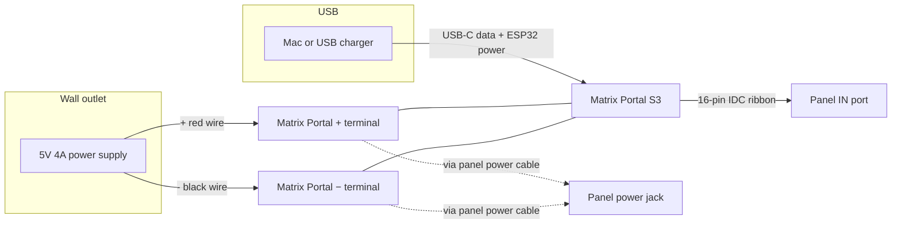

# Wiring — Matrix Portal S3 + 64×32 LED Panel (5036)

Panel: [Adafruit 64×32 RGB LED Matrix, 2.5mm pitch](https://www.adafruit.com/product/5036)  
Controller: [Adafruit Matrix Portal S3](https://www.adafruit.com/product/5778)

---

## Overview



**Two separate power paths:**

| Path | Powers | Cable |
|------|--------|--------|
| **USB-C** | Matrix Portal (ESP32, WiFi, logic) | USB-C to Mac/charger |
| **5V 4A supply** | LED panel (up to ~4A) | Red/black → Matrix Portal screw terminals |

USB alone is **not** enough for the LEDs at full brightness.

---

## Physical layout (side view)

```
                    ┌─────────────────────┐
                    │   64×32 LED PANEL   │
                    │                     │
    [power jack]◄───┤  (back of panel)    ├───►[IN]◄─── IDC ribbon ───┐
                    │                     │                    [OUT]     │
                    └─────────────────────┘                              │
                                                                         │
                    ┌─────────────────────┐                              │
                    │  MATRIX PORTAL S3   │◄─────────────────────────────┘
                    │  ┌───────────────┐  │
    5V + ──────────►│  │ +  −  screws │  │◄── red/black from panel power cable
    5V − ──────────►│  └───────────────┘  │
                    │      [USB-C]        │◄── USB to computer
                    └─────────────────────┘
```

---

## Step-by-step connections

### 1. Data (already done)

| From | To | Cable |
|------|-----|--------|
| Matrix Portal S3 | Panel **`IN`** (not `OUT`) | 16-pin IDC ribbon (included) |

### 2. Panel power cable (included with 5036)

| From | To |
|------|-----|
| Plug on cable | **Power jack** on back of LED panel |

The other end is **two wires** (usually spade lugs or bare):

| Wire color | Connect to Matrix Portal |
|------------|--------------------------|
| **Red** | **`+`** / **5V** screw terminal |
| **Black** | **`−`** / **GND** screw terminal |

### 3. Wall power supply (you supply this — ≥4A recommended)

| From supply | To Matrix Portal |
|-------------|------------------|
| **+5V** (red) | **`+`** terminal (same as panel red) |
| **GND** (black) | **`−`** terminal (same as panel black) |

If your adapter has a barrel plug only, use a barrel-to-screw-terminal adapter or a supply with bare leads. Adafruit suggests a [4A 5V regulated adapter](https://www.adafruit.com/product/1466) for this panel.

### 4. USB (programming + controller)

| From | To |
|------|-----|
| Mac or USB charger | Matrix Portal **USB-C** |

---

## Terminal block detail

```
Matrix Portal screw terminals (example)

     Panel red wire ────┐
     Supply +5V    ────┼──►  [ + ]  ← tighten screw
                        │
     Panel black wire ─┐
     Supply GND    ────┼──►  [ − ]  ← tighten screw
```

**Polarity matters.** Red = +5V, black = GND. Reversed polarity can damage the panel.

---

## Power-on order

1. Wire everything with **USB unplugged** (optional but safer).
2. Turn on **5V supply** (or plug it in).
3. Plug in **USB-C** for programming.
4. Panel should run firmware; LEDs draw from the 5V supply, not from USB.

---

## Quick checklist

- [ ] IDC cable on panel **`IN`**
- [ ] Panel power cable plugged into panel power jack
- [ ] Red → Matrix Portal **`+`**
- [ ] Black → Matrix Portal **`−`**
- [ ] 5V **4A** supply on same **`+`** / **`−`** terminals
- [ ] USB-C to computer (data + ESP32)
- [ ] Firmware: `color_order = "RbG"` (5036 green/blue swap — already in project)

---

## Related docs

- [SETUP.md](./SETUP.md) — software install, calibration, recovery
- [led_panel.md](./led_panel.md) — product links
